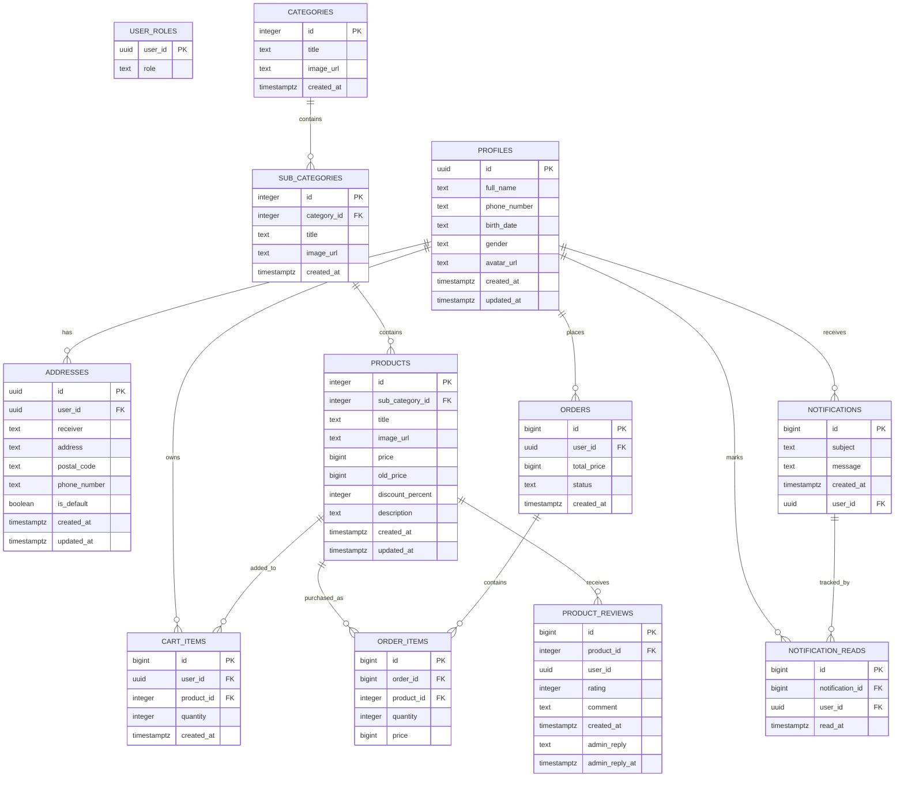

# 🛍️ Online Shop

> یک اپلیکیشن فروشگاه آنلاین Android با رابط کاربری مدرن، معماری لایه‌ای، Jetpack Compose و Backend مبتنی بر Supabase

[](https://kotlinlang.org/)
[](https://developer.android.com/compose)
[](https://supabase.com/)
[](https://developer.android.com/training/dependency-injection/hilt-android)
[](https://m3.material.io/)

---

## 📱 معرفی پروژه

**Online Shop** یک اپلیکیشن فروشگاه آنلاین برای سیستم‌عامل Android است که با زبان **Kotlin** و رابط کاربری **Jetpack Compose** توسعه داده شده است.

این پروژه با هدف پیاده‌سازی یک ساختار قابل توسعه و تفکیک‌شده طراحی شده و شامل Backend مبتنی بر **Supabase**، احراز هویت کاربران، پایگاه داده PostgreSQL، ذخیره‌سازی تصاویر، مدیریت سفارش‌ها، سبد خرید، علاقه‌مندی‌ها، نظرات، اعلان‌ها و مدیریت اطلاعات کاربران است.

ساختار پروژه بر پایه جداسازی مسئولیت‌ها طراحی شده و لایه‌های UI، Domain و Data از یکدیگر تفکیک شده‌اند.

---

# 🎨 طراحی UI/UX

طراحی رابط کاربری پروژه در **Figma** انجام شده و سپس بر اساس این طراحی، رابط Android با استفاده از **Jetpack Compose** پیاده‌سازی شده است.

فایل طراحی شامل ساختار صفحات، چیدمان اجزای رابط کاربری و جریان‌های اصلی تجربه کاربر در اپلیکیشن است.

🔗 **[مشاهده طراحی Online Shop در Figma](https://www.figma.com/design/1U0G6Yj9ctUuARNcjB5Bjx/online-shop?node-id=0-7&p=f&t=3Jy9reqM5y2polcC-0)**

---

# ✨ قابلیت‌های پروژه


## 🔐 احراز هویت کاربران

* ثبت‌نام و ورود کاربران
* مدیریت حساب کاربری
* احراز هویت با کد OTP ایمیل
* تغییر رمز عبور
* مدیریت Session
* اتصال به Supabase Authentication

---

## 🏠 صفحه اصلی

* نمایش محتوای اصلی فروشگاه
* Banner
* دسته‌بندی محصولات
* محصولات پرفروش
* جست‌وجوی محصولات
* نمایش نتایج جست‌وجو

---

## 🗂️ دسته‌بندی محصولات

* نمایش دسته‌بندی‌ها
* نمایش زیردسته‌ها
* مشاهده محصولات هر دسته
* انتخاب دسته و زیردسته
* Navigation بین صفحات مرتبط

ساختار Catalog:

```text
Category
   │
   └── Sub Category
          │
          └── Product
```

---

## 🛍️ محصولات

* نمایش لیست محصولات
* نمایش جزئیات محصول
* نمایش تصاویر محصول
* نمایش توضیحات
* نمایش اطلاعات محصول
* افزودن محصول به سبد خرید
* افزودن محصول به علاقه‌مندی‌ها
* مشاهده نظرات کاربران

---

## 🛒 سبد خرید

* مشاهده محصولات سبد خرید
* افزایش و کاهش تعداد محصولات
* حذف محصول
* محاسبه مبلغ سفارش
* انتخاب آدرس
* بررسی اطلاعات سفارش
* تکمیل فرآیند ثبت سفارش

---

## ❤️ علاقه‌مندی‌ها

* افزودن محصول به علاقه‌مندی‌ها
* حذف محصول از علاقه‌مندی‌ها
* نمایش محصولات موردعلاقه
* نگهداری علاقه‌مندی‌ها با Jetpack DataStore

---

## 📦 سفارش‌ها

* ثبت سفارش
* مشاهده سفارش‌های ثبت‌شده
* مشاهده خریدهای کاربر
* مشاهده آیتم‌های سفارش
* نمایش اطلاعات سفارش
* ارتباط سفارش‌ها با کاربر و محصولات

---

## ⭐ نظرات و تجربه خرید

* مشاهده نظرات کاربران
* ثبت نظر درباره محصول
* نمایش تجربه‌های خرید
* ثبت Rating و Comment
* مدیریت اطلاعات Review در Backend
* امکان پاسخ مدیریتی به Review

---

## 🔔 اعلان‌ها

* دریافت و نمایش اعلان‌های ذخیره‌شده در Backend
* نمایش لیست اعلان‌ها
* نمایش وضعیت خوانده‌شدن
* علامت‌گذاری اعلان به‌عنوان خوانده‌شده
* پشتیبانی Database از اعلان‌های عمومی و دارای User ID

---

## 👤 پروفایل

* مشاهده پروفایل
* ویرایش اطلاعات کاربر
* تغییر رمز عبور
* مدیریت اطلاعات شخصی
* مدیریت آدرس‌ها
* مدیریت تصویر پروفایل

---

## 📍 مدیریت آدرس

* مشاهده آدرس‌های کاربر
* افزودن آدرس
* ویرایش آدرس
* حذف آدرس
* انتخاب آدرس پیش‌فرض
* انتخاب آدرس هنگام ثبت سفارش

---

# 🏗️ معماری پروژه

ساختار پروژه بر پایه ترکیبی از **MVVM، Repository Pattern و جداسازی لایه‌های Data / Domain / UI** طراحی شده است.

جریان کلی داده در برنامه:

```text
┌──────────────────────────────┐
│       Jetpack Compose UI     │
│        Feature Screens       │
└──────────────┬───────────────┘
               │
               ▼
┌──────────────────────────────┐
│          ViewModel           │
│    State / Presentation Logic │
└──────────────┬───────────────┘
               │
               ▼
┌──────────────────────────────┐
│      Domain Repository       │
│         Interfaces           │
└──────────────┬───────────────┘
               │
               ▼
┌──────────────────────────────┐
│       Data Repository        │
│       Remote / Local         │
└──────────────┬───────────────┘
               │
          ┌────┴─────┐
          ▼          ▼
     ┌────────┐ ┌──────────┐
     │Supabase│ │ DataStore│
     └────────┘ └──────────┘
```

### اهداف معماری

* جداسازی مسئولیت‌ها
* کاهش وابستگی بین بخش‌ها
* قابلیت تست بهتر
* قابلیت توسعه و نگهداری آسان‌تر
* جلوگیری از وابستگی مستقیم UI به Data Source
* مدیریت متمرکز Dependencyها
* تفکیک مدل‌های Domain و DTOهای Remote
* جداسازی Local و Remote Data Source

---

# 📂 ساختار پروژه

ساختار اصلی Packageهای پروژه:

```text
io.github.sadeghi.online_shop
│
├── app
├── core
├── data
├── di
├── domain
├── feature
└── navigation
```

---

## `app`

شامل تنظیمات سطح Application است.

```text
app/
└── OnlineShopApplication.kt
```

---

# 🧰 Core

کدهای عمومی و قابل استفاده مجدد در کل پروژه در این بخش قرار گرفته‌اند.

```text
core/
├── common/
├── theme/
├── ui/
└── utils/
```

### `core/common`

ابزارهای عمومی مانند بررسی وضعیت شبکه.

### `core/theme`

تعریف Theme و طراحی ظاهری:

* Color
* Theme
* Typography

### `core/ui`

کامپوننت‌های قابل استفاده مجدد UI:

* TextField
* Button
* Card
* Shape
* Spacer
* سایر UI Components

### `core/utils`

توابع عمومی مانند:

* محاسبه قدرت رمز عبور
* فرمت تاریخ
* فرمت تاریخ شمسی
* فرمت تاریخ اعلان‌ها

---

# 🗃️ Data Layer

لایه Data مسئول ارتباط با منابع داده است.

```text
data/
├── constants/
├── local/
├── remote/
└── repository/
```

---

## Remote Data Source

ارتباط با Backend در این بخش مدیریت می‌شود.

```text
data/remote/
├── SupabaseClient.kt
└── dto/
```

DTOهای پروژه شامل مدل‌هایی برای:

* Product
* Profile
* Address
* Cart
* Order
* Order Item
* Notification
* Product Review
* Category
* SubCategory
* User Role

و سایر داده‌های مورد نیاز Backend هستند.

---

# 💾 Local Data

برای نگهداری برخی اطلاعات محلی از **Jetpack DataStore Preferences** استفاده شده است.

```text
data/local/datastore/
├── FavoritesDataStore.kt
└── UserPreferences.kt
```

این بخش برای نگهداری اطلاعات محلی و تنظیمات مورد نیاز برنامه استفاده می‌شود.

---

# 🧩 Repository Layer

Repositoryها واسط بین Domain و منابع داده هستند.

```text
data/repository/
├── AddressRepository.kt
├── AuthRepository.kt
├── CartRepository.kt
├── FavoritesRepository.kt
├── NotificationsRepositoryImpl.kt
├── OrderRepository.kt
├── ProductRepository.kt
├── ProductReviewRepository.kt
├── ProfileRepository.kt
└── SubCategoryRepository.kt
```

Repository Pattern باعث می‌شود ViewModelها مستقیماً به منبع داده وابسته نباشند.

> نام‌گذاری Repositoryها مطابق ساختار فعلی پروژه مستند شده است و `NotificationsRepositoryImpl.kt` به‌عنوان پیاده‌سازی مشخص Repository اعلان‌ها نگهداری می‌شود.

---

# 🧠 Domain Layer

لایه Domain شامل مدل‌های اصلی برنامه و قرارداد Repositoryها است.

```text
domain/
├── model/
└── repository/
```

### Domain Models

مدل‌هایی مانند:

* Product
* Order
* CartItems
* Address
* Notification
* ProductReview
* SubCategory

در این لایه قرار گرفته‌اند.

### Repository Interfaces

قراردادهای Repository نیز در Domain تعریف شده‌اند.

به این ترتیب Domain به پیاده‌سازی مستقیم Backend وابسته نیست.

---

# 🎨 Feature Layer

هر قابلیت اصلی برنامه در یک Feature مستقل قرار گرفته است.

```text
feature/
├── address/
├── auth/
├── cart/
├── category/
├── favorites/
├── home/
├── main/
├── notifications/
├── orders/
├── product/
├── profile/
└── splash/
```

این ساختار باعث می‌شود کدهای مربوط به هر قابلیت در محدوده مشخص خود قرار داشته باشند.

---

## Authentication

```text
feature/auth/
├── LoginScreen.kt
├── LoginViewModel.kt
├── component/
└── model/
```

---

## Home

```text
feature/home/
├── HomeScreen.kt
├── SearchResultScreen.kt
└── component/
```

---

## Product

```text
feature/product/
├── ProductDetailScreen.kt
├── ProductViewModel.kt
├── component/
└── review/
```

---

## Cart

```text
feature/cart/
├── CartScreen.kt
├── CartViewModel.kt
├── component/
└── model/
```

---

## Orders

```text
feature/orders/
├── MyBuyScreen.kt
├── MyOrdersScreen.kt
├── MyPurchaseItem.kt
├── OrderViewModel.kt
└── component/
```

---

## Profile

```text
feature/profile/
├── ProfileScreen.kt
├── ProfileViewModel.kt
├── EditProfile.kt
├── ChangePasswordViewModel.kt
└── component/
```

---

# 🧭 Navigation

Navigation در Package اختصاصی مدیریت می‌شود:

```text
navigation/
├── MainNavGraph.kt
├── Navgraph.kt
└── Screens.kt
```

Navigation بین Featureهای مختلف برنامه با Navigation Compose مدیریت می‌شود.

---

# 💉 Dependency Injection

برای Dependency Injection از **Dagger Hilt** استفاده شده است.

ماژول‌های اصلی:

```text
di/
├── DataStoreModule.kt
├── RepositoryModule.kt
└── SupabaseModule.kt
```

Hilt برای مدیریت وابستگی‌هایی مانند:

* Supabase Client
* DataStore
* Repositoryها

استفاده می‌شود.

---

# ☁️ Supabase Backend

این پروژه از **Supabase** به‌عنوان Backend اصلی استفاده می‌کند و از قابلیت‌های زیر استفاده می‌کند:

* Supabase Authentication
* PostgreSQL
* Row Level Security
* Supabase Storage

---

## 🏗️ Backend Architecture

```text
┌──────────────────────────────────────────┐
│              Android App                │
│                                          │
│ Jetpack Compose                         │
│ ViewModel                               │
│ Repository                              │
└────────────────────┬─────────────────────┘
                     │
                     │ Supabase SDK
                     ▼
┌──────────────────────────────────────────┐
│                Supabase                 │
│                                          │
│ ┌──────────────┐  ┌───────────────────┐ │
│ │ Supabase Auth│  │ PostgreSQL        │ │
│ │              │  │ + RLS Policies    │ │
│ └──────────────┘  └───────────────────┘ │
│                                          │
│ ┌──────────────────────────────────────┐ │
│ │ Storage                              │ │
│ │ avatars / banners / product-images   │ │
│ │ category-images / subcategory-images │ │
│ └──────────────────────────────────────┘ │
└──────────────────────────────────────────┘
```

---

# 🔐 Authentication

احراز هویت کاربران توسط **Supabase Auth** انجام می‌شود.

در Policyهای RLS، شناسه کاربر احراز هویت‌شده با:

```sql
auth.uid()
```

در PostgreSQL بررسی می‌شود.

جدول `profiles` اطلاعات تکمیلی کاربر را نگهداری می‌کند.

```text
Supabase Auth
      │
      │ auth.uid()
      ▼
   profiles
      │
      ├── addresses
      ├── cart_items
      ├── orders
      ├── notifications
      └── notification_reads
```

> `user_roles.user_id` نیز شناسه کاربر را نگهداری می‌کند، اما در Foreign Keyهای فعلی Database رابطه مستقیمی بین `user_roles` و `profiles` تعریف نشده است.

---

# 🗄️ PostgreSQL Database

Database پروژه شامل **۱۲ جدول اصلی** در Schema عمومی `public` است:

| Table                | مسئولیت                   |
| -------------------- | ------------------------- |
| `profiles`           | اطلاعات پروفایل کاربران   |
| `user_roles`         | نقش کاربران               |
| `addresses`          | آدرس‌های کاربران          |
| `categories`         | دسته‌بندی محصولات         |
| `sub_categories`     | زیردسته‌های محصولات       |
| `products`           | اطلاعات محصولات           |
| `cart_items`         | اقلام سبد خرید            |
| `orders`             | سفارش‌های ثبت‌شده         |
| `order_items`        | اقلام هر سفارش            |
| `product_reviews`    | نظرات و امتیازهای محصولات |
| `notifications`      | اعلان‌های سیستم           |
| `notification_reads` | وضعیت خوانده‌شدن اعلان‌ها |

---

# 🧩 Database Relationships

روابط **Foreign Key واقعی** دیتابیس:

```text
profiles
│
├── addresses
├── cart_items
├── orders
├── notifications
└── notification_reads

categories
└── sub_categories
       └── products
            ├── cart_items
            ├── order_items
            └── product_reviews

orders
└── order_items

notifications
└── notification_reads
```

### Foreign Keys

```text
cart_items.product_id
        └── products.id

cart_items.user_id
        └── profiles.id

notification_reads.notification_id
        └── notifications.id

notification_reads.user_id
        └── profiles.id

notifications.user_id
        └── profiles.id

order_items.order_id
        └── orders.id

order_items.product_id
        └── products.id

orders.user_id
        └── profiles.id

product_reviews.product_id
        └── products.id

products.sub_category_id
        └── sub_categories.id

sub_categories.category_id
        └── categories.id
```

> `product_reviews.user_id` در جدول وجود دارد، اما در ساختار فعلی Database برای آن Foreign Key به `profiles` تعریف نشده است.

> `user_roles.user_id` نیز در Schema وجود دارد، اما Foreign Key آن به `profiles` در ساختار فعلی تعریف نشده است.

---

# 📊 ER Diagram



---

# 🛒 Order Management

فرآیند ثبت سفارش در Backend دارای PostgreSQL Function زیر است:

```text
create_order_atomic(
    p_user_id,
    p_total_price,
    p_status,
    p_items,
    p_notification_subject,
    p_notification_message
)
```

مشخصات Function:

```text
Arguments:
p_user_id uuid
p_total_price bigint
p_status text
p_items jsonb
p_notification_subject text
p_notification_message text

Returns:
bigint
```

این Function ورودی‌های مربوط به سفارش، آیتم‌های سفارش و اطلاعات اعلان مرتبط را دریافت می‌کند و شناسه سفارش را به‌صورت `bigint` برمی‌گرداند.

جریان ارتباطی:

```text
Android
   │
   ▼
OrderRepository
   │
   ▼
create_order_atomic()
   │
   ├── Order Data
   ├── Order Items
   └── Notification Data
```

---

# 🔒 Row Level Security (RLS)

برای جداول مختلف پروژه **Policyهای Row Level Security** تعریف شده‌اند.

الگوی اصلی بسیاری از Policyها بر اساس:

```sql
auth.uid()
```

است.

برای مثال، Policyهای `addresses`، `cart_items` و `orders` مالکیت داده را نسبت به کاربر جاری بررسی می‌کنند.

> توضیحات زیر بر اساس Policyهای فعلی Database هستند و ممکن است با تغییر Policyها نیاز به بروزرسانی داشته باشند.

---

## 🛡️ RLS Policy Overview

| Table                | Policy Behavior                                                  |
| -------------------- | ---------------------------------------------------------------- |
| `addresses`          | مشاهده، ایجاد، ویرایش و حذف داده‌های متعلق به کاربر جاری         |
| `cart_items`         | مشاهده، ایجاد، ویرایش و حذف اقلام متعلق به کاربر جاری            |
| `categories`         | خواندن برای کاربران authenticated                                |
| `notification_reads` | مشاهده و مدیریت وضعیت خواندن مربوط به کاربر جاری                 |
| `notifications`      | ایجاد اعلان با `user_id` متعلق به کاربر و چند Policy برای SELECT |
| `order_items`        | دسترسی بر اساس مالکیت Order مربوطه                               |
| `orders`             | ایجاد و مشاهده سفارش‌های کاربر                                   |
| `product_reviews`    | مشاهده نظرات + ایجاد و حذف نظر توسط کاربر                        |
| `products`           | خواندن برای کاربران authenticated                                |
| `profiles`           | Policyهای SELECT، INSERT و UPDATE                                |
| `sub_categories`     | خواندن برای کاربران authenticated                                |
| `user_roles`         | مشاهده Role مربوط به کاربر جاری                                  |

### Order Item Security

دسترسی به `order_items` از طریق مالکیت سفارش کنترل می‌شود.

```text
auth.uid()
    │
    ▼
orders.user_id
    │
    ▼
orders.id
    │
    ▼
order_items.order_id
```

Policy ابتدا بررسی می‌کند Order متعلق به کاربر جاری باشد و سپس دسترسی به `order_items` همان سفارش را کنترل می‌کند.

### Notification Security

در وضعیت فعلی Database، جدول `notifications` دارای یک Policy `SELECT` با شرط `true` برای کاربران authenticated است.

از آنجا که Policyهای `SELECT` به‌صورت **PERMISSIVE** تعریف شده‌اند، این Policy باعث می‌شود کاربران authenticated بتوانند اعلان‌های موجود در جدول را بخوانند.

بنابراین README این پروژه عمداً ادعا نمی‌کند که دسترسی فعلی Notifications فقط به اعلان عمومی و اعلان متعلق به همان کاربر محدود شده است.

---

### Profile Security

در جدول `profiles` نیز یک Policy `SELECT` با شرط `true` وجود دارد.

بنابراین در وضعیت فعلی، کاربران authenticated می‌توانند رکوردهای جدول `profiles` را بخوانند.

Policy دیگری برای مشاهده پروفایل خود کاربر نیز وجود دارد، اما به دلیل **PERMISSIVE** بودن Policyها، شرط `true` محدودیت مشاهده را به «فقط پروفایل خود کاربر» محدود نمی‌کند.

---

# ⚙️ Database Functions

Backend شامل Functions زیر است:

### `create_order_atomic`

برای عملیات مرتبط با ثبت سفارش:

```text
create_order_atomic(
    p_user_id uuid,
    p_total_price bigint,
    p_status text,
    p_items jsonb,
    p_notification_subject text,
    p_notification_message text
) → bigint
```

---

### `reply_to_product_review`

برای پاسخ به Review:

```text
reply_to_product_review(
    p_review_id bigint,
    p_reply text
)
```

---

### `update_product_review`

برای بروزرسانی Rating و Comment:

```text
update_product_review(
    p_review_id bigint,
    p_rating integer,
    p_comment text
)
```

---

### `set_default_address`

برای مدیریت آدرس پیش‌فرض:

```text
set_default_address(
    address_id uuid
)
```

---

### `rls_auto_enable`

یک PostgreSQL **Event Trigger Function** در Schema `public` است.

---

# 🔔 Notifications

سیستم اعلان از دو جدول اصلی استفاده می‌کند:

```text
notifications
       │
       └── notification_reads
```

جدول `notifications` شامل:

* `subject`
* `message`
* `created_at`
* `user_id`

است.

`user_id` می‌تواند `NULL` باشد و امکان نگهداری اعلان‌های عمومی را فراهم می‌کند.

جدول `notification_reads` نیز وضعیت خوانده‌شدن اعلان توسط کاربر را نگهداری می‌کند.

---

# ⭐ Product Reviews

نظرات محصولات در جدول:

```text
product_reviews
```

نگهداری می‌شوند.

اطلاعات Review شامل:

* Product ID
* User ID
* Rating
* Comment
* Creation Time
* Admin Reply
* Admin Reply Time

است.

ارتباط Foreign Key مستقیم:

```text
products
    │
    └── product_reviews
```

`product_reviews.user_id` شناسه کاربری Review را نگهداری می‌کند، اما در ساختار فعلی Foreign Key مستقیمی به `profiles` ندارد.

---

# 📦 Storage

تصاویر پروژه در **Supabase Storage** نگهداری می‌شوند.

Bucketهای فعلی:

| Bucket               | کاربرد                 |
| -------------------- | ---------------------- |
| `avatars`            | تصاویر پروفایل کاربران |
| `banners`            | تصاویر Banner          |
| `category-images`    | تصاویر دسته‌بندی‌ها    |
| `product-images`     | تصاویر محصولات         |
| `subcategory-images` | تصاویر زیردسته‌ها      |

طبق وضعیت فعلی Supabase، هر پنج Bucket به‌صورت `public` تعریف شده‌اند.

Public بودن Bucket به این معناست که فایل‌های موجود در آن می‌توانند از طریق URL عمومی قابل دسترسی باشند؛ این موضوع به‌تنهایی به معنی عمومی بودن مجوز **Upload** نیست.

در Database، URL تصاویر در فیلدهایی مانند:

```text
avatar_url
image_url
```

ذخیره می‌شود.

---

# 🔄 Backend Data Flow

```text
┌─────────────────────┐
│   Jetpack Compose   │
└──────────┬──────────┘
           │
           ▼
┌─────────────────────┐
│     ViewModel       │
└──────────┬──────────┘
           │
           ▼
┌─────────────────────┐
│     Repository      │
└──────────┬──────────┘
           │
           ▼
┌─────────────────────────────┐
│       Supabase SDK          │
├─────────────────────────────┤
│ Auth                        │
│ PostgreSQL / PostgREST      │
│ Storage                     │
└──────────────┬──────────────┘
               │
               ▼
┌─────────────────────────────┐
│       PostgreSQL            │
│                             │
│ RLS Policies → Data         │
└─────────────────────────────┘
```

---

# 🔐 Security Principles

اصول امنیتی پروژه شامل موارد زیر است:

* استفاده از Supabase Authentication
* استفاده از `auth.uid()` در Policyهای RLS
* کنترل مالکیت داده‌ها در جداول مرتبط با کاربران
* کنترل دسترسی `order_items` از طریق مالکیت Order
* استفاده از جدول `user_roles` برای نگهداری Role
* متمرکز کردن عملیات ثبت سفارش در Database Function
* عدم قرار دادن Service Role Key در اپلیکیشن Android

> **هشدار امنیتی:** Secretها، Service Role Key و سایر اطلاعات حساس نباید در Repository عمومی GitHub یا README قرار گیرند.

---

# 🧱 Database Design

ساختار Backend بر اساس تفکیک موجودیت‌های اصلی فروشگاه طراحی شده است:

```text
Authentication
      │
      ▼
User Profile
      │
      ├── Address
      ├── Cart
      ├── Orders
      ├── Notifications
      └── Notification Reads

Catalog
   │
   └── Category
        │
        └── Sub Category
             │
             └── Product
                  ├── Cart Items
                  ├── Order Items
                  └── Reviews

Order
   │
   └── Order Items

Notification
   │
   └── Notification Reads
```

روابط Database در این نمودار بر اساس Foreign Keyهای فعلی هستند؛ روابطی مانند Authentication → Profile یا User ID موجود در `product_reviews` الزاماً به معنی Foreign Key PostgreSQL نیستند.

---

# 🔄 جریان داده

جریان کلی درخواست‌ها:

```text
User
 │
 ▼
Compose Screen
 │
 ▼
ViewModel
 │
 ▼
Repository Interface
 │
 ▼
Repository Implementation
 │
 ▼
Supabase / DataStore
 │
 ▼
Result
 │
 ▼
StateFlow
 │
 ▼
Compose UI
```

این ساختار UI را از جزئیات مربوط به منبع داده جدا نگه می‌دارد.

---

# 🧵 Coroutines & StateFlow

برای عملیات asynchronous از **Kotlin Coroutines** استفاده شده است.

برای مدیریت State در ViewModelها از `StateFlow` استفاده می‌شود.

الگوی کلی:

```text
Repository
    │
    ▼
Coroutine
    │
    ▼
ViewModel
    │
    ▼
StateFlow
    │
    ▼
Compose
```

---

# 🖼️ مدیریت تصاویر

برای بارگذاری تصاویر در رابط کاربری از **Coil** استفاده شده است.

برای برش تصاویر نیز **uCrop** در پروژه قرار گرفته است.

---

# 🎨 رابط کاربری

UI پروژه با **Jetpack Compose** و **Material 3** پیاده‌سازی شده است.

ویژگی‌های اصلی:

* Declarative UI
* Material 3
* Reusable Components
* Custom Components
* Custom Theme
* Animation
* State-driven UI

کامپوننت‌های عمومی در:

```text
core/ui/
```

قرار گرفته‌اند.

---

# 🧰 تکنولوژی‌ها

## Android

| تکنولوژی           | کاربرد               |
| ------------------ | -------------------- |
| Kotlin             | زبان برنامه‌نویسی    |
| Jetpack Compose    | رابط کاربری          |
| Material 3         | طراحی رابط کاربری    |
| AndroidX           | کتابخانه‌های پایه    |
| Navigation Compose | Navigation           |
| Lifecycle          | مدیریت Lifecycle     |
| ViewModel          | مدیریت State و Logic |

## Architecture

| تکنولوژی           | کاربرد               |
| ------------------ | -------------------- |
| MVVM               | معماری Presentation  |
| Repository Pattern | جداسازی Data Source  |
| Hilt               | Dependency Injection |
| Coroutines         | عملیات Asynchronous  |
| StateFlow          | Reactive State       |

## Backend

| تکنولوژی           | کاربرد               |
| ------------------ | -------------------- |
| Supabase Auth      | احراز هویت           |
| PostgreSQL         | پایگاه داده          |
| Supabase Storage   | ذخیره فایل و تصاویر  |
| Row Level Security | کنترل دسترسی داده‌ها |

## UI & Media

| کتابخانه         | کاربرد         |
| ---------------- | -------------- |
| Coil             | Image Loading  |
| uCrop            | Image Cropping |
| ConstraintLayout | Layout         |
| Material Icons   | آیکون‌ها       |

## Local Storage

| کتابخانه              | کاربرد            |
| --------------------- | ----------------- |
| DataStore Preferences | Local Preferences |

---

# 📦 مدیریت Dependencyها

Dependencyهای پروژه از طریق **Gradle Version Catalog** مدیریت می‌شوند.

فایل:

```text
gradle/libs.versions.toml
```

مرجع مرکزی نسخه‌های Libraryها و Pluginهای پروژه است.

نسخه‌های اصلی فعلی پروژه شامل:

| Dependency            | Version      |
| --------------------- | ------------ |
| Kotlin                | `2.3.10`     |
| Android Gradle Plugin | `9.4.0`      |
| Jetpack Compose BOM   | `2026.08.00` |
| Hilt                  | `2.60.1`     |
| Supabase BOM          | `3.8.0`      |
| Coil                  | `3.3.0`      |
| Navigation Compose    | `2.9.8`      |
| DataStore             | `1.2.1`      |

> Version Catalog شامل Dependencyهای بیشتری نیز هست؛ جدول بالا فقط نسخه‌های اصلی مورد استفاده در مستندات پروژه را نشان می‌دهد.

---

# 🔒 امنیت Android

موارد امنیتی پروژه شامل:

* استفاده از Supabase Authentication
* جداسازی Configurationهای حساس
* عدم قرار دادن Secretهای Backend در Git
* استفاده از Release Build
* فعال بودن R8 / ProGuard در Release
* استفاده از Signed APK برای نسخه Release

اطلاعات حساس Backend باید خارج از Repository عمومی نگهداری شوند و نباید در Source Code یا README قرار گیرند.

---

# 🛡️ R8 / ProGuard

برای نسخه Release قابلیت Minification فعال شده است.

```kotlin
buildTypes {
    release {
        isMinifyEnabled = true
        proguardFiles(
            getDefaultProguardFile("proguard-android-optimize.txt"),
            "proguard-rules.pro"
        )
    }
}
```

نسخه Release با R8/ProGuard ساخته و روی دستگاه واقعی آزمایش شده است.

---

# 🧪 Testing

نسخه Release پروژه با Minification فعال ساخته و روی دستگاه واقعی بررسی شده است.

بررسی‌های انجام‌شده شامل بخش‌های اصلی برنامه مانند:

* Authentication
* ارتباط با Supabase
* محصولات
* تصاویر
* سبد خرید
* ثبت سفارش
* سفارش‌های کاربر
* Profile
* Notifications
* Reviews
* DataStore

در وضعیت فعلی، این README ادعایی درباره وجود Unit Test یا UI Test خودکار ندارد.

توسعه تست‌های خودکار می‌تواند در مراحل بعدی پروژه انجام شود.

---

# 🚀 اجرای پروژه

### 1. Clone کردن Repository

```bash
git clone <REPOSITORY_URL>
```

### 2. باز کردن پروژه

پروژه را در Android Studio باز کنید.

### 3. Gradle Sync

اجازه دهید Gradle Dependencyهای پروژه را دریافت و Sync کند.

### 4. تنظیم Backend

Configuration مربوط به Supabase را مطابق تنظیمات پروژه در محیط توسعه قرار دهید.

اطلاعات حساس مانند:

* Service Role Key
* Secret Keys
* سایر Credentialهای خصوصی

نباید در Git Commit شوند یا در Repository عمومی قرار بگیرند.

### 5. اجرای پروژه

برنامه را روی Emulator یا Android Device اجرا کنید.

---

# 🏗️ Build

نسخه Debug:

```bash
./gradlew assembleDebug
```

نسخه Release:

```bash
./gradlew assembleRelease
```

---

# 📱 Release

نسخه Release پروژه با موارد زیر ساخته شده است:

* R8 / ProGuard
* Minification
* Signed APK

و روی دستگاه واقعی آزمایش شده است.

---

# 🗺️ وضعیت قابلیت‌ها

* [x] Authentication
* [x] Home
* [x] Product Catalog
* [x] Categories
* [x] Subcategories
* [x] Product Details
* [x] Search
* [x] Favorites
* [x] Cart
* [x] Address Management
* [x] Order Creation
* [x] My Orders
* [x] Purchase History
* [x] Product Reviews
* [x] Notifications
* [x] Profile
* [x] Password Management
* [x] Supabase Backend
* [x] DataStore
* [x] Release Build
* [x] R8 / ProGuard

---

# 🗺️ Roadmap

قابلیت‌های احتمالی آینده:

* [ ] اتصال به درگاه پرداخت واقعی
* [ ] پنل مدیریت
* [ ] پنل فروشنده
* [ ] سیستم پیشرفته مدیریت سفارش
* [ ] گزارش‌گیری و Analytics
* [ ] Push Notification پیشرفته
* [ ] Unit Tests
* [ ] UI Tests

---

# 🧩 ساختار کلی سیستم

```text
                         ┌───────────────────────┐
                         │      Android App      │
                         │    Kotlin + Compose   │
                         └───────────┬───────────┘
                                     │
                                     ▼
                         ┌───────────────────────┐
                         │       ViewModel       │
                         └───────────┬───────────┘
                                     │
                                     ▼
                         ┌───────────────────────┐
                         │      Repository       │
                         └───────────┬───────────┘
                                     │
                    ┌────────────────┴────────────────┐
                    │                                 │
                    ▼                                 ▼
          ┌──────────────────┐              ┌──────────────────┐
          │    DataStore     │              │     Supabase     │
          │   Local Storage  │              │     Backend      │
          └──────────────────┘              └────────┬─────────┘
                                                     │
                                  ┌──────────────────┼──────────────────┐
                                  │                  │                  │
                                  ▼                  ▼                  ▼
                               Auth             PostgreSQL           Storage
```

---

# 📚 اصول طراحی پروژه

در توسعه پروژه اصول زیر مورد توجه قرار گرفته‌اند:

* Separation of Concerns
* Single Responsibility
* Repository Pattern
* Dependency Injection
* Feature-based Organization
* Reusable UI Components
* State-driven UI
* Separation of Domain Models and DTOs
* Local / Remote Data Separation
* Maintainable Project Structure

---

# 👨‍💻 توسعه‌دهنده

**Sadeghi**

Android Developer
Kotlin / Jetpack Compose / Supabase

---

# 📄 License

این پروژه در حال حاضر License مشخصی ندارد. شرایط استفاده، انتشار و مجوز کد در نسخه نهایی Repository تعیین خواهد شد.

---

## ⭐ درباره پروژه

این پروژه با تمرکز بر پیاده‌سازی یک سیستم فروشگاه آنلاین واقعی توسعه داده شده است و علاوه بر رابط کاربری Android، شامل Backend، احراز هویت، پایگاه داده PostgreSQL، Storage، مدیریت سفارش، سبد خرید، نظرات، اعلان‌ها و مدیریت اطلاعات کاربران است.

هدف اصلی پروژه، پیاده‌سازی یک ساختار قابل توسعه و قابل نگهداری با استفاده از تکنولوژی‌های مدرن Android و یک Backend ابری است.
