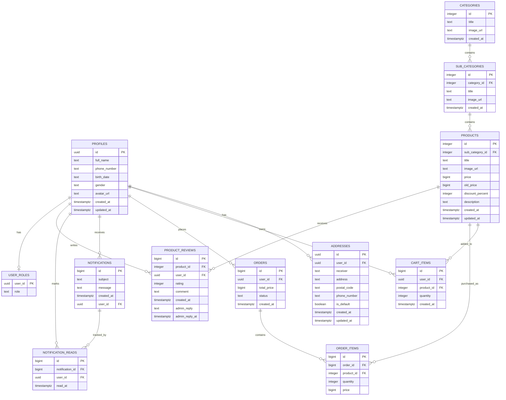

# 🛍️ Online Shop

> یک اپلیکیشن فروشگاه آنلاین اندروید با رابط کاربری مدرن، معماری لایه‌ای، Jetpack Compose و Backend مبتنی بر Supabase

[](https://kotlinlang.org/)
[](https://developer.android.com/compose)
[](https://supabase.com/)
[](https://developer.android.com/training/dependency-injection/hilt-android)
[](https://m3.material.io/)

---

## 📱 معرفی پروژه

**Online Shop** یک اپلیکیشن فروشگاه آنلاین برای سیستم‌عامل Android است که با زبان **Kotlin** و رابط کاربری **Jetpack Compose** توسعه داده شده است.

این پروژه با هدف پیاده‌سازی یک ساختار قابل توسعه و تفکیک‌شده طراحی شده و علاوه بر رابط کاربری، شامل Backend واقعی مبتنی بر **Supabase**، احراز هویت کاربران، پایگاه داده PostgreSQL، ذخیره‌سازی تصاویر، مدیریت سفارش‌ها، سبد خرید، علاقه‌مندی‌ها، نظرات و اعلان‌ها است.

ساختار پروژه بر پایه جداسازی مسئولیت‌ها طراحی شده و لایه‌های UI، Domain و Data از یکدیگر تفکیک شده‌اند.

---

# ✨ قابلیت‌های پروژه

## 🔐 احراز هویت کاربران

* ثبت‌نام و ورود کاربران
* مدیریت حساب کاربری
* تأیید اطلاعات کاربر
* تغییر رمز عبور
* مدیریت Session
* اتصال مستقیم به Supabase Authentication

---

## 🏠 صفحه اصلی

* نمایش محتوای اصلی فروشگاه
* Banner
* دسته‌بندی محصولات
* محصولات پرفروش
* جست‌وجوی محصولات
* نمایش نتایج جست‌وجو

---

## 🗂️ دسته‌بندی محصولات

* نمایش دسته‌بندی‌ها
* نمایش زیردسته‌ها
* مشاهده محصولات هر دسته
* انتخاب دسته و زیردسته
* Navigation بین صفحات مرتبط

---

## 🛍️ محصولات

* نمایش لیست محصولات
* نمایش جزئیات محصول
* نمایش تصاویر محصول
* نمایش توضیحات
* نمایش ویژگی‌های محصول
* افزودن محصول به سبد خرید
* افزودن محصول به علاقه‌مندی‌ها
* مشاهده نظرات کاربران

---

## 🛒 سبد خرید

* مشاهده محصولات سبد خرید
* افزایش و کاهش تعداد محصولات
* حذف محصول
* محاسبه مبلغ سفارش
* انتخاب آدرس
* بررسی اطلاعات سفارش
* تکمیل فرآیند ثبت سفارش

---

## ❤️ علاقه‌مندی‌ها

* افزودن محصول به علاقه‌مندی‌ها
* حذف محصول از علاقه‌مندی‌ها
* نمایش محصولات موردعلاقه
* نگهداری اطلاعات علاقه‌مندی‌ها در Local Storage

---

## 📦 سفارش‌ها

* ثبت سفارش
* مشاهده سفارش‌های ثبت‌شده
* مشاهده خریدهای کاربر
* مشاهده آیتم‌های سفارش
* نمایش اطلاعات سفارش
* ارتباط سفارش‌ها با اطلاعات کاربر و محصولات

---

## ⭐ نظرات و تجربه خرید

* مشاهده نظرات کاربران
* ثبت نظر درباره محصول
* نمایش تجربه‌های خرید
* اتصال نظرات به محصول و کاربر
* مدیریت اطلاعات Review در Backend

---

## 🔔 اعلان‌ها

* دریافت اعلان‌های کاربر
* نمایش لیست اعلان‌ها
* نمایش وضعیت خوانده‌شدن
* علامت‌گذاری اعلان به‌عنوان خوانده‌شده
* دریافت اطلاعات اعلان از Backend

---

## 👤 پروفایل

* مشاهده پروفایل
* ویرایش اطلاعات کاربر
* تغییر رمز عبور
* مدیریت اطلاعات شخصی
* مدیریت آدرس‌ها

---

## 📍 مدیریت آدرس

* مشاهده آدرس‌های کاربر
* افزودن آدرس
* ویرایش آدرس
* انتخاب آدرس هنگام ثبت سفارش

---

# 🏗️ معماری پروژه

ساختار پروژه بر پایه ترکیبی از **MVVM، Repository Pattern و جداسازی لایه‌های Data / Domain / UI** طراحی شده است.

جریان کلی داده در برنامه:

```text
┌──────────────────────────────┐
│       Jetpack Compose UI     │
│        Feature Screens       │
└──────────────┬───────────────┘
               │
               ▼
┌──────────────────────────────┐
│          ViewModel           │
│    State / Business Logic    │
└──────────────┬───────────────┘
               │
               ▼
┌──────────────────────────────┐
│      Domain Repository       │
│        Interfaces            │
└──────────────┬───────────────┘
               │
               ▼
┌──────────────────────────────┐
│       Data Repository        │
│       Remote / Local         │
└──────────────┬───────────────┘
               │
          ┌────┴─────┐
          ▼          ▼
     ┌────────┐ ┌──────────┐
     │Supabase│ │ DataStore│
     └────────┘ └──────────┘
```

### اهداف معماری

* جداسازی مسئولیت‌ها
* کاهش وابستگی بین بخش‌ها
* قابلیت تست بهتر
* قابلیت توسعه و نگهداری آسان‌تر
* جلوگیری از وابستگی مستقیم UI به Data Source
* مدیریت متمرکز وابستگی‌ها
* تفکیک مدل‌های Domain و DTOهای Remote

---

# 📂 ساختار پروژه

ساختار اصلی Packageهای پروژه:

```text
io.github.sadeghi.online_shop
│
├── app
├── core
├── data
├── di
├── domain
├── feature
└── navigation
```

---

## `app`

شامل تنظیمات سطح Application است.

```text
app/
└── OnlineShopApplication.kt
```

Application اصلی پروژه در این بخش قرار دارد.

---

## `core`

کدهای عمومی و قابل استفاده مجدد در کل پروژه در این بخش قرار گرفته‌اند.

```text
core/
├── common/
├── theme/
├── ui/
└── utils/
```

### `core/common`

ابزارهای عمومی مانند بررسی وضعیت شبکه.

### `core/theme`

تعریف Theme و طراحی ظاهری:

* Color
* Theme
* Typography

### `core/ui`

کامپوننت‌های قابل استفاده مجدد UI:

* TextField
* Button
* Card
* Shape
* Spacer
* سایر UI Components

### `core/utils`

توابع عمومی مانند:

* محاسبه قدرت رمز عبور
* فرمت تاریخ
* فرمت تاریخ شمسی
* فرمت تاریخ اعلان‌ها

---

# 🗃️ Data Layer

لایه Data مسئول ارتباط با منابع داده است.

```text
data/
├── constants/
├── local/
├── remote/
└── repository/
```

---

## Remote Data Source

ارتباط با Backend در این بخش مدیریت می‌شود.

```text
data/remote/
├── SupabaseClient.kt
└── dto/
```

DTOهای پروژه شامل مدل‌هایی برای:

* Product
* Profile
* Address
* Cart
* Order
* Order Item
* Notification
* Product Review
* Category
* SubCategory
* User Role

و سایر داده‌های مورد نیاز Backend هستند.

---

# 💾 Local Data

برای نگهداری برخی اطلاعات محلی از **Jetpack DataStore** استفاده شده است.

```text
data/local/datastore/
├── FavoritesDataStore.kt
└── UserPreferences.kt
```

این بخش برای نگهداری اطلاعات محلی و تنظیمات مورد نیاز برنامه استفاده می‌شود.

---

# 🧩 Repository Layer

Repositoryها واسط بین لایه Data و سایر بخش‌های برنامه هستند.

```text
data/repository/
├── AddressRepository.kt
├── AuthRepository.kt
├── CartRepository.kt
├── FavoritesRepository.kt
├── NotificationsRepositoryImpl.kt
├── OrderRepository.kt
├── ProductRepository.kt
├── ProductReviewRepository.kt
├── ProfileRepository.kt
└── SubCategoryRepository.kt
```

Repository Pattern باعث می‌شود ViewModelها مستقیماً به منبع داده وابسته نباشند.

---

# 🧠 Domain Layer

لایه Domain شامل مدل‌های اصلی برنامه و قرارداد Repositoryها است.

```text
domain/
├── model/
└── repository/
```

### Domain Models

مدل‌هایی مانند:

* Product
* Order
* CartItems
* Address
* Notification
* ProductReview
* SubCategory

در این لایه قرار گرفته‌اند.

### Repository Interfaces

قراردادهای Repository نیز در Domain تعریف شده‌اند.

به این ترتیب لایه Domain به پیاده‌سازی مستقیم Backend وابسته نیست.

---

# 🎨 Feature Layer

هر قابلیت اصلی برنامه در یک Feature مستقل قرار گرفته است.

```text
feature/
├── address/
├── auth/
├── cart/
├── category/
├── favorites/
├── home/
├── main/
├── notifications/
├── orders/
├── product/
├── profile/
└── splash/
```

این ساختار باعث می‌شود کدهای مربوط به هر قابلیت در یک محدوده مشخص قرار داشته باشند.

---

## Authentication

```text
feature/auth/
├── LoginScreen.kt
├── LoginViewModel.kt
├── component/
└── model/
```

فرآیندهای مختلف ورود و احراز هویت در این Feature مدیریت می‌شوند.

---

## Home

```text
feature/home/
├── HomeScreen.kt
├── SearchResultScreen.kt
└── component/
```

---

## Product

```text
feature/product/
├── ProductDetailScreen.kt
├── ProductViewModel.kt
├── component/
└── review/
```

---

## Cart

```text
feature/cart/
├── CartScreen.kt
├── CartViewModel.kt
├── component/
└── model/
```

---

## Orders

```text
feature/orders/
├── MyBuyScreen.kt
├── MyOrdersScreen.kt
├── MyPurchaseItem.kt
├── OrderViewModel.kt
└── component/
```

---

## Profile

```text
feature/profile/
├── ProfileScreen.kt
├── ProfileViewModel.kt
├── EditProfile.kt
├── ChangePasswordViewModel.kt
└── component/
```

---

# 🧭 Navigation

Navigation در Package اختصاصی مدیریت می‌شود:

```text
navigation/
├── MainNavGraph.kt
├── Navgraph.kt
└── Screens.kt
```

Navigation بین Featureهای مختلف برنامه از طریق Navigation Compose مدیریت می‌شود.

---

# 💉 Dependency Injection

برای Dependency Injection از **Dagger Hilt** استفاده شده است.

ماژول‌های اصلی:

```text
di/
├── DataStoreModule.kt
├── RepositoryModule.kt
└── SupabaseModule.kt
```

Hilt برای مدیریت وابستگی‌هایی مانند:

* Supabase Client
* DataStore
* Repositoryها

استفاده می‌شود.

این روش باعث کاهش Coupling و ساده‌تر شدن مدیریت وابستگی‌های پروژه می‌شود.

---

## ☁️ Supabase Backend

این پروژه از **Supabase** به‌عنوان Backend اصلی استفاده می‌کند و بخش‌های Authentication، PostgreSQL Database، Row Level Security (RLS) و Storage را پوشش می‌دهد.

معماری Backend به‌گونه‌ای طراحی شده است که داده‌های حساس کاربر در سطح PostgreSQL نیز با استفاده از RLS محافظت شوند و عملیات مهمی مانند ثبت سفارش در سمت Database به‌صورت اتمیک انجام شوند.

---

### 🏗️ Backend Architecture

```text
┌──────────────────────────────────────────┐
│              Android App                │
│                                          │
│ Jetpack Compose                         │
│ ViewModel                               │
│ Repository                              │
└────────────────────┬─────────────────────┘
                     │
                     │ Supabase SDK
                     ▼
┌──────────────────────────────────────────┐
│                Supabase                 │
│                                          │
│ ┌──────────────┐  ┌───────────────────┐ │
│ │ Supabase Auth│  │ PostgreSQL        │ │
│ │              │  │ + RLS             │ │
│ └──────────────┘  └───────────────────┘ │
│                                          │
│ ┌──────────────────────────────────────┐ │
│ │ Storage                              │ │
│ │ avatars / banners / product-images   │ │
│ │ category-images / subcategory-images │ │
│ └──────────────────────────────────────┘ │
└──────────────────────────────────────────┘
```

---

## 🔐 Authentication

احراز هویت کاربران توسط **Supabase Auth** انجام می‌شود.

در دیتابیس، شناسه کاربر احراز هویت‌شده از طریق:

```sql
auth.uid()
```

در Policyهای RLS استفاده می‌شود.

جدول `profiles` نیز اطلاعات تکمیلی کاربر را نگهداری می‌کند و `profiles.id` با شناسه کاربر احراز هویت‌شده مرتبط است.

```text
Supabase Auth
      │
      │ auth.uid()
      ▼
   profiles
      │
      ├── addresses
      ├── cart_items
      ├── orders
      ├── notifications
      └── user_roles
```

---

# 🗄️ PostgreSQL Database

Database پروژه شامل **۱۲ جدول اصلی** در Schema عمومی `public` است:

| Table                | مسئولیت                   |
| -------------------- | ------------------------- |
| `profiles`           | اطلاعات پروفایل کاربران   |
| `user_roles`         | نقش کاربران               |
| `addresses`          | آدرس‌های کاربران          |
| `categories`         | دسته‌بندی محصولات         |
| `sub_categories`     | زیردسته‌های محصولات       |
| `products`           | اطلاعات محصولات           |
| `cart_items`         | اقلام سبد خرید            |
| `orders`             | سفارش‌های ثبت‌شده         |
| `order_items`        | اقلام هر سفارش            |
| `product_reviews`    | نظرات و امتیازهای محصولات |
| `notifications`      | اعلان‌های سیستم           |
| `notification_reads` | وضعیت خوانده‌شدن اعلان‌ها |

---

# 🧩 Database Relationships

ساختار ارتباطی اصلی دیتابیس:

```text
profiles
│
├── addresses
│
├── user_roles
│
├── cart_items
│      └── products
│
├── orders
│      └── order_items
│              └── products
│
├── notifications
│      └── notification_reads
│
└── product_reviews
       └── products


categories
└── sub_categories
       └── products
```

---

## 📊 ER Diagram



---

# 🛒 Order Management

فرآیند سفارش در Backend با استفاده از تابع PostgreSQL زیر پیاده‌سازی شده است:

```text
create_order_atomic(
    p_user_id,
    p_total_price,
    p_status,
    p_items,
    p_notification_subject,
    p_notification_message
)
```

این تابع:

* سفارش را ایجاد می‌کند.
* اقلام سفارش را ایجاد می‌کند.
* اطلاعات سفارش را در ارتباط با کاربر ثبت می‌کند.
* اعلان مرتبط با سفارش را ایجاد می‌کند.
* نتیجه را به‌صورت `bigint` برمی‌گرداند.

استفاده از یک تابع Database برای این عملیات باعث می‌شود عملیات اصلی ثبت سفارش در یک مسیر اتمیک در PostgreSQL انجام شود.

```text
Android
   │
   ▼
OrderRepository
   │
   ▼
create_order_atomic()
   │
   ├── orders
   │
   ├── order_items
   │
   └── notifications
```

---

# 🔒 Row Level Security (RLS)

برای جداول حساس پروژه از **Row Level Security** استفاده شده است.

الگوی اصلی امنیتی پروژه بر اساس:

```sql
auth.uid()
```

است.

یعنی دسترسی کاربر به داده‌ها بر اساس شناسه کاربر احراز هویت‌شده در PostgreSQL کنترل می‌شود.

### User-scoped Data

کاربر تنها می‌تواند داده‌های متعلق به خودش را در بخش‌هایی مانند موارد زیر مشاهده یا مدیریت کند:

* Addresses
* Cart Items
* Orders
* Order Items
* Notification Reads
* Profile
* User Role
* Reviews مربوط به خودش

به‌عنوان نمونه، Policy مربوط به آدرس‌ها از چنین منطقی استفاده می‌کند:

```sql
auth.uid() = user_id
```

در نتیجه یک کاربر نمی‌تواند صرفاً با تغییر شناسه کاربر، به آدرس کاربر دیگری دسترسی پیدا کند.

---

## 🛡️ RLS Policy Overview

| Table                | Access Control                               |
| -------------------- | -------------------------------------------- |
| `addresses`          | فقط داده‌های کاربر جاری                      |
| `cart_items`         | فقط سبد کاربر جاری                           |
| `categories`         | خواندن توسط کاربران احراز هویت‌شده           |
| `notification_reads` | فقط وضعیت اعلان‌های کاربر جاری               |
| `notifications`      | خواندن اعلان‌ها + ایجاد اعلان متعلق به کاربر |
| `order_items`        | فقط آیتم‌های سفارش‌های متعلق به کاربر        |
| `orders`             | ایجاد و مشاهده سفارش‌های کاربر               |
| `product_reviews`    | مشاهده نظرات + ایجاد/حذف نظر خود کاربر       |
| `products`           | خواندن توسط کاربران احراز هویت‌شده           |
| `profiles`           | مشاهده + ایجاد/ویرایش پروفایل                |
| `sub_categories`     | خواندن توسط کاربران احراز هویت‌شده           |
| `user_roles`         | فقط Role کاربر جاری                          |

### Order Item Security

برای `order_items`، مالکیت فقط با یک `user_id` مستقیم بررسی نمی‌شود.

Policy بررسی می‌کند که `order_id` مربوط به سفارشی باشد که متعلق به کاربر فعلی است:

```text
auth.uid()
    │
    ▼
orders.user_id
    │
    ▼
orders.id
    │
    ▼
order_items.order_id
```

این ساختار باعث می‌شود دسترسی به آیتم سفارش نیز به مالکیت خود سفارش وابسته باشد.

---

# ⚙️ Database Functions

Backend شامل توابع PostgreSQL زیر است:

### `create_order_atomic`

ثبت اتمیک سفارش و عملیات مرتبط با آن.

```text
Arguments:
p_user_id uuid
p_total_price bigint
p_status text
p_items jsonb
p_notification_subject text
p_notification_message text

Returns:
bigint
```

---

### `reply_to_product_review`

برای ثبت پاسخ به نظر محصول:

```text
reply_to_product_review(
    p_review_id bigint,
    p_reply text
)
```

---

### `update_product_review`

برای بروزرسانی نظر و امتیاز محصول:

```text
update_product_review(
    p_review_id bigint,
    p_rating integer,
    p_comment text
)
```

---

### `set_default_address`

برای مدیریت آدرس پیش‌فرض کاربر:

```text
set_default_address(
    address_id uuid
)
```

---

### `rls_auto_enable`

یک PostgreSQL **Event Trigger Function** است که برای مدیریت فعال‌سازی RLS در سطح Database تعریف شده است.

---

# 🔔 Notifications

سیستم اعلان در دو جدول اصلی طراحی شده است:

```text
notifications
       │
       └── notification_reads
```

جدول `notifications` شامل اعلان‌هایی است که می‌توانند:

* عمومی باشند (`user_id = NULL`)
* یا متعلق به یک کاربر مشخص باشند.

و جدول `notification_reads` وضعیت خوانده‌شدن اعلان توسط کاربر را نگهداری می‌کند.

این طراحی امکان مدیریت اعلان‌های عمومی و اعلان‌های اختصاصی کاربر را فراهم می‌کند.

---

# ⭐ Product Reviews

نظرات محصولات در جدول:

```text
product_reviews
```

نگهداری می‌شوند.

هر Review شامل:

* Product ID
* User ID
* Rating
* Comment
* Creation Time
* Admin Reply
* Admin Reply Time

است.

ارتباط:

```text
profiles
    │
    └── product_reviews
             │
             ▼
          products
```

برای مدیریت Review نیز توابع اختصاصی PostgreSQL در Backend وجود دارد.

---

# 📦 Storage

تصاویر پروژه در Supabase Storage نگهداری می‌شوند.

Bucketهای فعلی:

| Bucket               | کاربرد                 |
| -------------------- | ---------------------- |
| `avatars`            | تصاویر پروفایل کاربران |
| `banners`            | تصاویر Banner          |
| `category-images`    | تصاویر دسته‌بندی‌ها    |
| `product-images`     | تصاویر محصولات         |
| `subcategory-images` | تصاویر زیردسته‌ها      |

تمام Bucketهای فعلی طبق تنظیمات Database به‌صورت `public` تعریف شده‌اند.

آدرس تصاویر در جداول مربوطه با فیلدهایی مانند:

```text
avatar_url
image_url
```

ذخیره می‌شود.

---

# 🔄 Backend Data Flow

```text
┌─────────────────────┐
│   Jetpack Compose   │
└──────────┬──────────┘
           │
           ▼
┌─────────────────────┐
│     ViewModel       │
└──────────┬──────────┘
           │
           ▼
┌─────────────────────┐
│     Repository      │
└──────────┬──────────┘
           │
           ▼
┌─────────────────────────────┐
│       Supabase SDK          │
├─────────────────────────────┤
│ Auth                        │
│ PostgreSQL / PostgREST      │
│ Storage                     │
└──────────────┬──────────────┘
               │
               ▼
┌─────────────────────────────┐
│       PostgreSQL            │
│                             │
│ RLS → Policies → Data       │
└─────────────────────────────┘
```

---

# 🔐 Security Principles

امنیت Backend بر اساس چند اصل اصلی طراحی شده است:

* استفاده از Supabase Authentication برای هویت کاربران
* استفاده از `auth.uid()` برای تشخیص کاربر جاری
* استفاده از Row Level Security برای محدود کردن دسترسی به داده‌ها
* محدود کردن داده‌های شخصی به مالک آن‌ها
* کنترل دسترسی به سفارش‌ها از طریق مالکیت Order
* جداسازی Role کاربر در جدول `user_roles`
* انجام عملیات حساس ثبت سفارش در Database Function
* عدم نیاز به قرار دادن Service Role Key در اپلیکیشن Android

> **نکته امنیتی:** کلیدهای خصوصی، Service Role Key، Secretها و اطلاعات حساس محیطی نباید در Repository عمومی GitHub یا README قرار بگیرند.

---

# 🧱 Database Design Principles

ساختار Backend پروژه بر پایه جداسازی مسئولیت‌ها طراحی شده است:

```text
Authentication
      │
      ▼
User Profile
      │
      ├── Address
      ├── Cart
      ├── Orders
      ├── Reviews
      ├── Notifications
      └── Role

Catalog
   │
   └── Category
        │
        └── Sub Category
             │
             └── Product

Order
   │
   └── Order Items
```

این ساختار باعث می‌شود موجودیت‌های اصلی فروشگاه از یکدیگر تفکیک شده و روابط بین آن‌ها به‌صورت Foreign Key در PostgreSQL تعریف شوند.
.

---

# 🔄 جریان داده

جریان کلی درخواست‌ها در برنامه:

```text
User
 │
 ▼
Compose Screen
 │
 ▼
ViewModel
 │
 ▼
Repository Interface
 │
 ▼
Repository Implementation
 │
 ▼
Supabase / DataStore
 │
 ▼
Result
 │
 ▼
StateFlow
 │
 ▼
Compose UI
```

این ساختار باعث می‌شود UI از جزئیات مربوط به Backend و نحوه ذخیره‌سازی داده مستقل باشد.

---

# 📡 Network Layer

برای ارتباطات شبکه‌ای و سرویس‌های مورد نیاز پروژه از ابزارهای Kotlin و کتابخانه‌های مرتبط با HTTP استفاده شده است.

کتابخانه‌های موجود در پروژه شامل:

* Ktor Client
* OkHttp
* Retrofit
* Kotlin Serialization
* Gson

هستند.

در قسمت‌هایی که از Supabase Kotlin SDK استفاده می‌شود، ارتباط با سرویس‌های Supabase از طریق Client مربوط به Supabase انجام می‌شود.

---

# 🧵 Coroutines & StateFlow

برای عملیات asynchronous از Kotlin Coroutines استفاده شده است.

و برای مدیریت وضعیت Reactive در ViewModelها از `StateFlow` استفاده می‌شود.

الگوی کلی:

```text
Repository
    │
    ▼
Coroutine
    │
    ▼
ViewModel
    │
    ▼
StateFlow
    │
    ▼
Compose
```

---

# 🖼️ مدیریت تصاویر

برای بارگذاری تصاویر در رابط کاربری از **Coil** استفاده شده است.

همچنین برای برش تصاویر از **uCrop** استفاده می‌شود.

---

# 🎨 رابط کاربری

UI پروژه با **Jetpack Compose** پیاده‌سازی شده است.

ویژگی‌های اصلی:

* Declarative UI
* Material 3
* Reusable Components
* Custom Components
* Custom Theme
* Animation
* Responsive Layout
* مدیریت State در Compose

کامپوننت‌های عمومی پروژه در:

```text
core/ui/
```

قرار گرفته‌اند.

---

# 🧰 تکنولوژی‌ها و کتابخانه‌ها

## Android

| تکنولوژی           | کاربرد               |
| ------------------ | -------------------- |
| Kotlin             | زبان برنامه‌نویسی    |
| Jetpack Compose    | رابط کاربری          |
| Material 3         | طراحی رابط کاربری    |
| AndroidX           | کتابخانه‌های پایه    |
| Navigation Compose | Navigation           |
| Lifecycle          | مدیریت Lifecycle     |
| ViewModel          | مدیریت State و Logic |

## Architecture

| تکنولوژی           | کاربرد                |
| ------------------ | --------------------- |
| MVVM               | معماری UI             |
| Repository Pattern | جداسازی Data Source   |
| Hilt               | Dependency Injection  |
| Coroutines         | عملیات asynchronous   |
| StateFlow          | مدیریت Reactive State |

## Backend

| تکنولوژی          | کاربرد           |
| ----------------- | ---------------- |
| Supabase Auth     | احراز هویت       |
| PostgreSQL        | پایگاه داده      |
| Supabase Storage  | ذخیره فایل       |
| Supabase Realtime | داده‌های بلادرنگ |

## Network & Serialization

| تکنولوژی             | کاربرد             |
| -------------------- | ------------------ |
| Ktor                 | HTTP Client        |
| OkHttp               | Network            |
| Retrofit             | REST API           |
| Kotlin Serialization | Serialization      |
| Gson                 | JSON Serialization |

## UI & Media

| کتابخانه         | کاربرد         |
| ---------------- | -------------- |
| Coil             | Image Loading  |
| uCrop            | Image Cropping |
| ConstraintLayout | Layout         |
| Material Icons   | آیکون‌ها       |

## Local Storage

| کتابخانه              | کاربرد            |
| --------------------- | ----------------- |
| DataStore Preferences | Local Preferences |

---

# 📦 مدیریت Dependencyها

Dependencyهای پروژه از طریق **Gradle Version Catalog** مدیریت می‌شوند.

فایل:

```text
gradle/libs.versions.toml
```

مرجع مرکزی نسخه‌های کتابخانه‌ها و Pluginهای پروژه است.

این روش باعث می‌شود مدیریت نسخه‌ها متمرکز و قابل نگهداری باشد.

---

# 🔒 امنیت

در طراحی پروژه تلاش شده اطلاعات حساس مستقیماً در کد عمومی Repository قرار نگیرند.

موارد امنیتی پروژه شامل:

* استفاده از Supabase Authentication
* جداسازی Configurationهای حساس
* عدم قرار دادن Secretهای Backend در Git
* استفاده از Release Build
* فعال بودن R8 / ProGuard در Release
* استفاده از Signed APK برای نسخه Release

> **نکته:** کلیدهای حساس Supabase مانند Service Role Key نباید در Repository عمومی GitHub قرار گیرند.

---

# 🛡️ R8 / ProGuard

برای نسخه Release قابلیت Minification فعال شده است.

```kotlin
buildTypes {
    release {
        isMinifyEnabled = true
        proguardFiles(
            getDefaultProguardFile("proguard-android-optimize.txt"),
            "proguard-rules.pro"
        )
    }
}
```

نسخه Release با R8/ProGuard ساخته و روی دستگاه واقعی آزمایش شده است.

---

# 🧪 تست و بررسی Release

نسخه Release پروژه پس از فعال‌سازی Minification ساخته شده و APK امضاشده روی دستگاه واقعی بررسی شده است.

موارد اصلی برنامه در Release بررسی شده‌اند، از جمله:

* Authentication
* ارتباط با Supabase
* محصولات
* تصاویر
* سبد خرید
* ثبت سفارش
* سفارش‌های کاربر
* Profile
* Notifications
* Reviews
* DataStore

---

# 🚀 اجرای پروژه

برای اجرای پروژه:

### 1. Clone کردن Repository

```bash
git clone <REPOSITORY_URL>
```

### 2. باز کردن پروژه

پروژه را در Android Studio باز کنید.

### 3. Sync کردن Gradle

اجازه دهید Gradle Dependencyهای پروژه را دریافت و Sync کند.

### 4. تنظیم Backend

اطلاعات مورد نیاز Supabase را طبق Configuration پروژه تنظیم کنید.

> اطلاعات حساس مانند Secret Key یا Service Role Key نباید داخل GitHub Commit شوند.

### 5. اجرای پروژه

برنامه را روی Emulator یا Android Device اجرا کنید.

---

# 🏗️ Build

برای ساخت نسخه Debug:

```bash
./gradlew assembleDebug
```

برای ساخت نسخه Release:

```bash
./gradlew assembleRelease
```

نسخه Release با R8/ProGuard ساخته می‌شود.

---

# 📱 Release

نسخه Release پروژه با:

* R8 / ProGuard
* Minification
* Signed APK

ساخته و روی دستگاه واقعی تست شده است.

---

# 🗺️ Roadmap

وضعیت قابلیت‌های اصلی فعلی:

* [x] Authentication
* [x] Home
* [x] Product Catalog
* [x] Categories
* [x] Subcategories
* [x] Product Details
* [x] Search
* [x] Favorites
* [x] Cart
* [x] Address Management
* [x] Order Creation
* [x] My Orders
* [x] Purchase History
* [x] Product Reviews
* [x] Notifications
* [x] Profile
* [x] Password Management
* [x] Supabase Backend
* [x] DataStore
* [x] Release Build
* [x] R8 / ProGuard

قابلیت‌های آینده، در صورت توسعه پروژه، می‌توانند شامل مواردی مانند:

* [ ] اتصال به درگاه پرداخت واقعی
* [ ] پنل مدیریت
* [ ] پنل فروشنده
* [ ] سیستم پیشرفته مدیریت سفارش
* [ ] گزارش‌گیری و Analytics
* [ ] Push Notification پیشرفته

باشند.

---

# ⚠️ محدودیت‌های فعلی

این بخش برای مستندسازی صادقانه وضعیت پروژه در نظر گرفته شده است.

هر قابلیتی که هنوز در پروژه پیاده‌سازی نشده باشد، باید به‌عنوان Future Work یا Roadmap معرفی شود و نه به‌عنوان قابلیت فعلی سیستم.

---

# 📸 Screenshots

> تصاویر واقعی پروژه در این بخش قرار خواهند گرفت.

### 🔐 Authentication

<!-- screenshot -->

### 🏠 Home

<!-- screenshot -->

### 🛍️ Product

<!-- screenshot -->

### 🛒 Cart

<!-- screenshot -->

### 📦 Orders

<!-- screenshot -->

### 👤 Profile

<!-- screenshot -->

### 🔔 Notifications

<!-- screenshot -->

---

# 🧩 ساختار کلی سیستم

```text
                         ┌───────────────────────┐
                         │      Android App      │
                         │    Kotlin + Compose   │
                         └───────────┬───────────┘
                                     │
                                     ▼
                         ┌───────────────────────┐
                         │       ViewModel       │
                         └───────────┬───────────┘
                                     │
                                     ▼
                         ┌───────────────────────┐
                         │      Repository       │
                         └───────────┬───────────┘
                                     │
                    ┌────────────────┴────────────────┐
                    │                                 │
                    ▼                                 ▼
          ┌──────────────────┐              ┌──────────────────┐
          │    DataStore     │              │     Supabase     │
          │   Local Storage  │              │     Backend      │
          └──────────────────┘              └────────┬─────────┘
                                                     │
                                  ┌──────────────────┼──────────────────┐
                                  │                  │                  │
                                  ▼                  ▼                  ▼
                               Auth             PostgreSQL           Storage
```

---

# 📚 اصول طراحی پروژه

در توسعه پروژه اصول زیر مورد توجه قرار گرفته‌اند:

* Separation of Concerns
* Single Responsibility
* Repository Pattern
* Dependency Injection
* Feature-based Organization
* Reusable UI Components
* State-driven UI
* Separation of Domain Models and DTOs
* Local / Remote Data Separation
* Modular and Maintainable Structure

---

# 👨‍💻 توسعه‌دهنده

**Sadeghi**

Android Developer
Kotlin / Jetpack Compose / Supabase

---

# 📄 License

مجوز استفاده از پروژه در نسخه نهایی Repository مشخص خواهد شد.

---

## ⭐ درباره پروژه

این پروژه با تمرکز بر طراحی و پیاده‌سازی یک سیستم فروشگاه آنلاین واقعی توسعه داده شده است و علاوه بر رابط کاربری Android، شامل Backend، احراز هویت، پایگاه داده، ذخیره‌سازی فایل، مدیریت سفارش، سبد خرید، نظرات، اعلان‌ها و مدیریت اطلاعات کاربران است.

هدف اصلی پروژه، پیاده‌سازی یک ساختار قابل توسعه و قابل نگهداری با استفاده از تکنولوژی‌های مدرن Android و یک Backend ابری است.
